# 모델 비교표

## 실험 설정 — 설계 변수별 비교

| 설계 변수 | **17ch_braid** | **17ch_mattecnn_braid** | **exp3_braid** |
|---|:---:|:---:|:---:|
| MatteCNN | ❌ | **✅** | ❌ |
| matte 1ch 처리 | downsample | downsample | downsample |
| sketch-matte fusion | sketch_lat ∥ matte_raw[1ch] | **(sketch_lat ⊕ matte_feat)** ∥ matte_raw[1ch] | sketch_lat ∥ matte_raw[1ch] |
| ctrl_cond 채널 | 16+1 = 17ch | 16+1 = 17ch | 16+1 = 17ch |
| ControlNet 주입 위치 | 모든 블록 (front 12 → 전체 24) | 모든 블록 (front 12 → 전체 24) | **짝수 블록만 (0,2,...,22)** |

## 이미지 비교 (Braid, 5샘플)

| Sketch | GT | 17ch_braid | 17ch_mattecnn | exp3_braid |
|:---:|:---:|:---:|:---:|:---:|
|  |  |  |  |  |
|  |  | 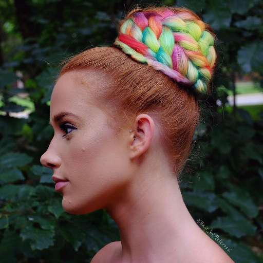 | 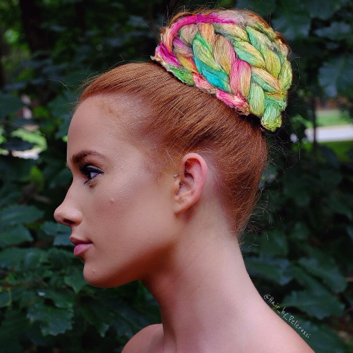 | 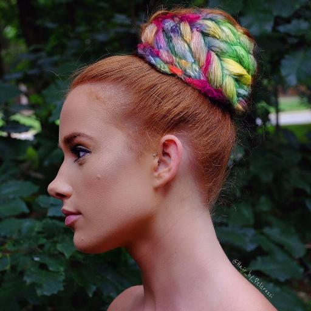 |
| 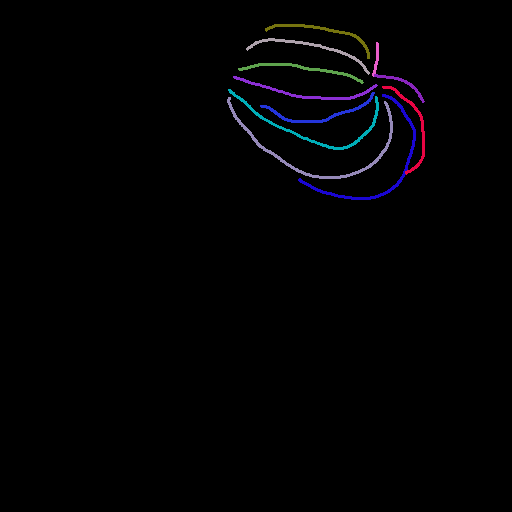 |  | 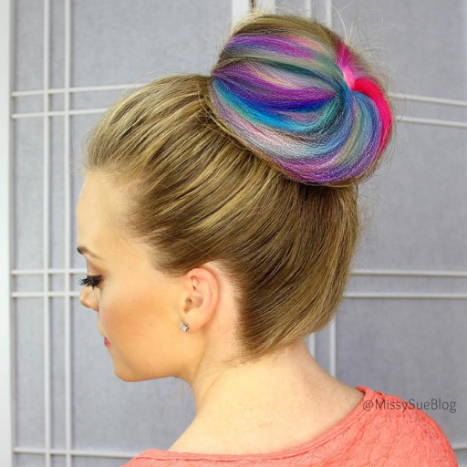 | 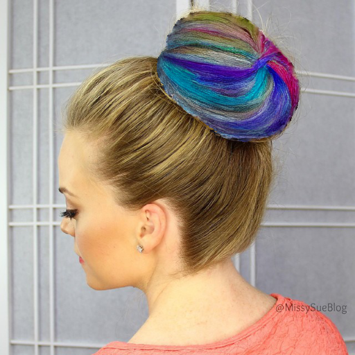 | 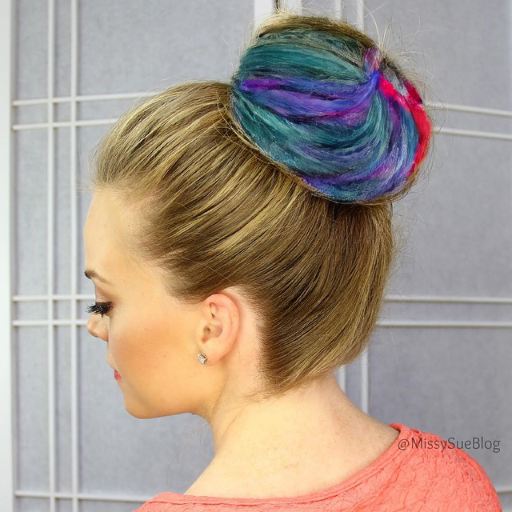 |
|  | 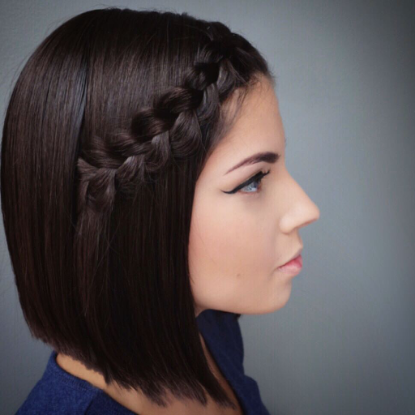 | 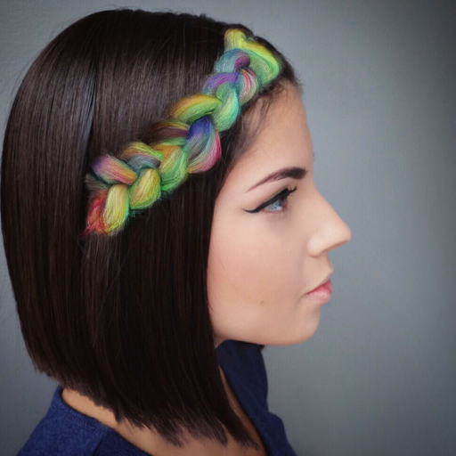 |  | 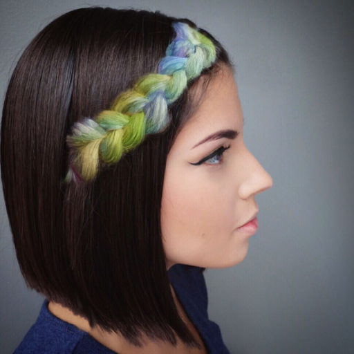 |
|  |  |  | 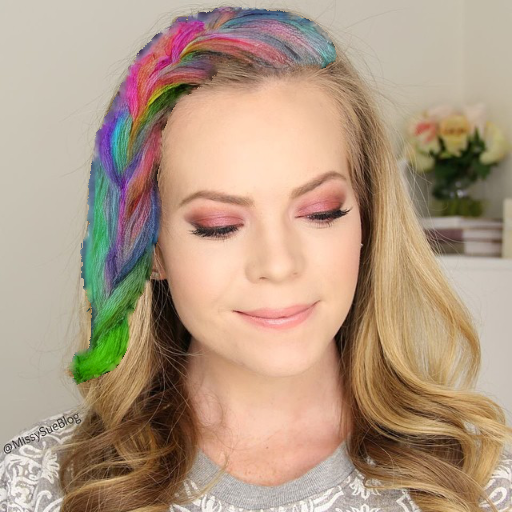 |  |

## 평가 결과 -- 추후기재 예정

### Combined (Braid + Unbraid)

| Metric | 17ch_combined |
|---|---|
| Edge IoU ↑ | |
| Chamfer Dist ↓ | |
| Sketch LPIPS ↓ | |
| Hair FID ↓ | |
| LPIPS (GT) ↓ | |
| SSIM (GT) ↑ | |
| PSNR (GT) ↑ | |
| Boundary FID ↓ | |
| Boundary LPIPS ↓ | |
| Face LPIPS ↓ | |
| ArcFace Cos ↑ | |
