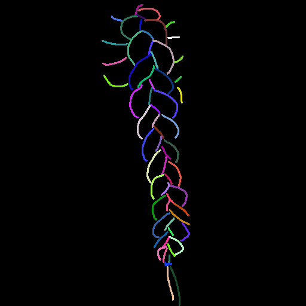
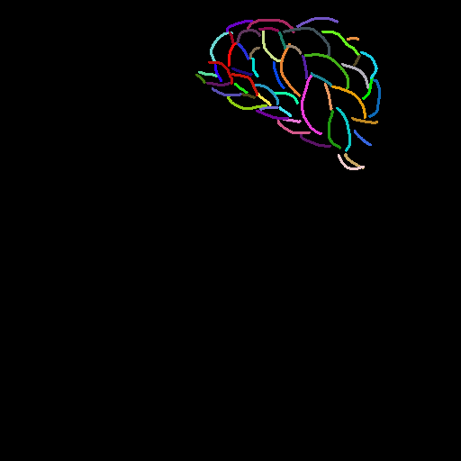
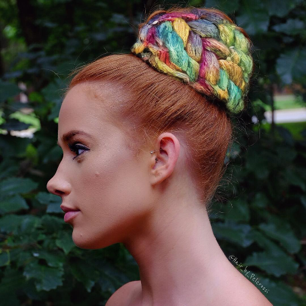
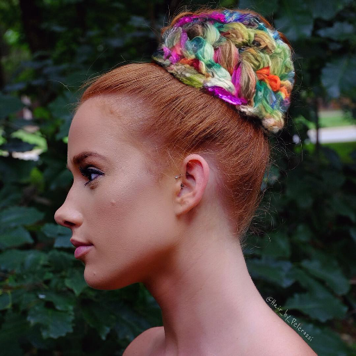

# MCS 4-way Ablation 결과 보고

## 4-way Ablation

|     | gate ✗  | gate ✓  |
|:------:|:------:|:------:|
| **matte cond ✓** | **mcs1** | **mcs2**  |
| **matte cond ✗** | **mcs3** | **mcs4**  |

- **matte cond ✓** : matte + stetch 모두 사용 
- **matte cond ✗** : sketch만 사용

---
## 이미지 비교
unbraid 40epoch 학습 후 braid **40epoch** 학습 결과
| Sketch | GT | mcs1 | mcs2 | mcs3 | mcs4 |
|:---:|:---:|:---:|:---:|:---:|:---:|
|  |  |  |  |  |  |
|  |  |  |  |  |  |
|  |  |  |  |  |  |

unbraid 40epoch 학습 후 braid **50epoch** 학습 결과
| Sketch | GT | mcs1 | mcs3 |
|:---:|:---:|:---:|:---:|
|  |  |  |  |
|  |  |  |  |
|  |  |  |  |

## 평가 결과

unbraid 40epoch 학습 후 braid **40epoch** 평가 결과
| Metric | mcs1 | mcs2 | mcs3 | mcs4 |
|--------|------|------|------|------|
| Edge IoU ↑ | 0.0640 | 0.0643 | 0.0628 | 0.0628 |
| Chamfer Dist ↓ | 4.7013 | 4.6655 | 4.8089 | 4.8726 |
| Sketch LPIPS ↓ | 0.7599 | 0.7679 | 0.7567 | 0.7416 |
| Hair FID ↓ | N/A | N/A | N/A | N/A |
| LPIPS (GT) ↓ | 0.2973 | 0.3314 | 0.3066 | 0.3282 |
| SSIM (GT) ↑ | 0.5893 | 0.5891 | 0.5866 | 0.5906 |
| PSNR (GT) ↑ | 11.6486 | 11.4002 | 11.5611 | 11.4483 |
| Boundary FID ↓ | N/A | N/A | N/A | N/A |
| Boundary LPIPS ↓ | 0.0197 | 0.0214 | 0.0220 | 0.0227 |
| Face LPIPS ↓ | 0.0033 | 0.0037 | 0.0033 | 0.0037 |
| ArcFace Cos ↑ | 0.6860 | 0.6733 | 0.7014 | 0.6685 |

unbraid 40epoch 학습 후 braid **50epoch** 평가 결과
| Metric | mcs1 | mcs2 | mcs3 | mcs4 |
|--------|------|------|------|------|
| Edge IoU ↑ | 0.0639 | x | 0.0632 | x |
| Chamfer Dist ↓ | 4.6947 | x | 4.7713 | x |
| Sketch LPIPS ↓ | 0.7611 | x | 0.7617 | x |
| Hair FID ↓ | N/A | x | N/A | x |
| LPIPS (GT) ↓ | 0.2941 | x | 0.3057 | x |
| SSIM (GT) ↑ | 0.5899 | x | 0.5862 | x |
| PSNR (GT) ↑ | 11.7388 | x | 11.6754 | x |
| Boundary FID ↓ | N/A | x | N/A | x |
| Boundary LPIPS ↓ | 0.0193 | x | 0.0213 | x |
| Face LPIPS ↓ | 0.0032 | x | 0.0032 | x |
| ArcFace Cos ↑ | 0.6877 | x | 0.6979 | x |

> mc2, mc4는 추후 기재 예정