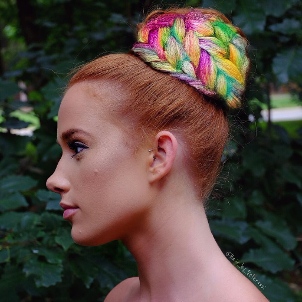
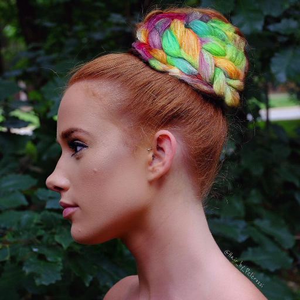
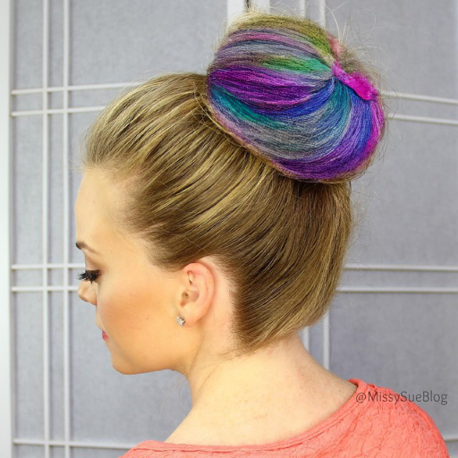
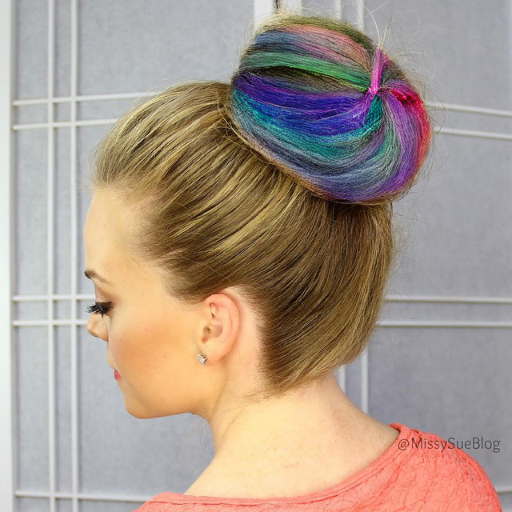

# MatteCNN Ablation 결과 보고 (mcs5,6)

## 실험 설정

| | raw matte (1ch) | MatteCNN feat |
|:------:|:------:|:------:|
| **mcs1** | ✓ | ✓ |
| **mcs3** | ✗ | ✗ |
| **mcs5** | ✓ | ✗ |
| **mcs6** | ✗ | ✓ |

---

## 이미지 비교

unbraid 40epoch 학습 후 braid **40epoch** 학습 결과

| Sketch | GT | mcs1 | mcs3 | mcs5 | mcs6 |
|:---:|:---:|:---:|:---:|:---:|:---:|
|  |  |  |  |  |  |
|  |  |  |  |  |  |
|  |  |  |  |  |  |

---

## 평가 결과

unbraid 40epoch 학습 후 braid **40epoch** 평가 결과

| Metric | mcs1 | mcs3 | mcs5 | mcs6 |
|--------|------|------|------|------|
| Edge IoU ↑ | 0.0640 | 0.0628 | 0.0637 | 0.0638 |
| Chamfer Dist ↓ | 4.7013 | 4.8089 | 4.6665 | 4.7403 |
| Sketch LPIPS ↓ | 0.7599 | 0.7567 | 0.7584 | 0.7386 |
| Hair FID ↓ | 1.1078 | 1.5352 | 1.3141 | 1.1242 |
| LPIPS (GT) ↓ | 0.2973 | 0.3066 | 0.2904 | 0.2850 |
| SSIM (GT) ↑ | 0.5893 | 0.5866 | 0.6075 | 0.6116 |
| PSNR (GT) ↑ | 11.6486 | 11.5611 | 12.0964 | 12.2796 |
| Boundary FID ↓ | 0.0121 | 0.0108 | 0.0006 | 0.0006 |
| Boundary LPIPS ↓ | 0.0197 | 0.0220 | 0.0049 | 0.0048 |
| Face LPIPS ↓ | 0.0033 | 0.0033 | 0.0005 | 0.0005 |
| ArcFace Cos ↑ | 0.6860 | 0.7014 | 0.7000 | 0.7258 |
