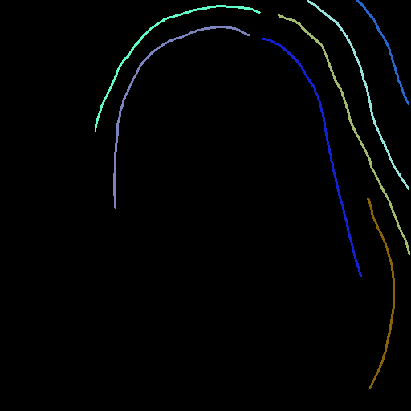
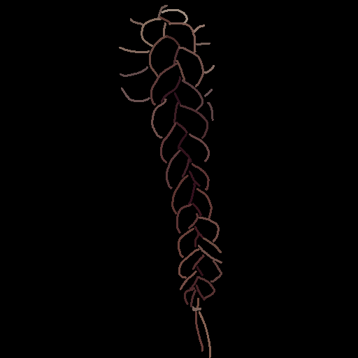
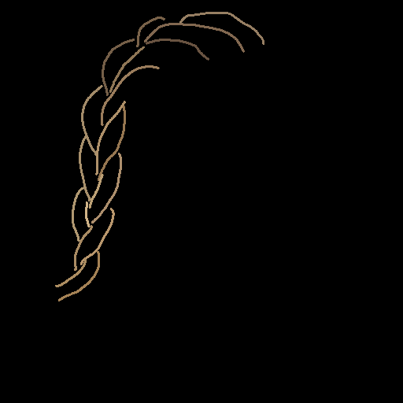
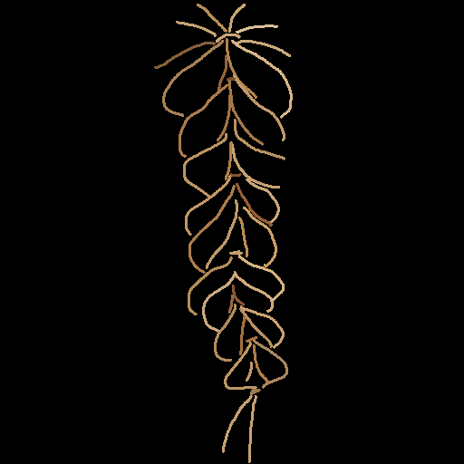
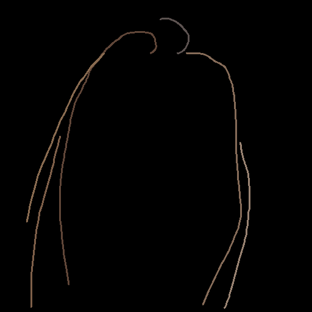
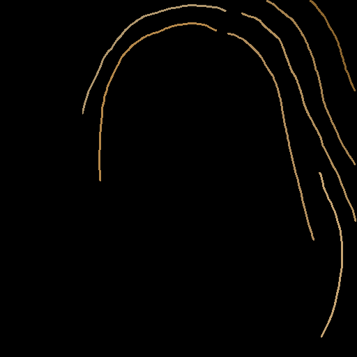

# Cross-Identity 생성 결과 비교

대표 이미지 5개 × mcs1~6 비교  
- braid 3개: braid_2534, braid_2562, braid_2572  
- unbraid 2개: CM_1004, CM_1006

---

## MCS 구성

| exp | MatteCNN (16ch) | raw matte (1ch) | gate | ctrl_cond |
|-----|:---:|:---:|:---:|-----------|
| mcs1 | ✅ | ✅ | ❌ | sketch + CNN + raw (full MCS) |
| mcs2 | ✅ | ✅ | ✅ | sketch + CNN + raw + gate |
| mcs3 | ❌ | ❌ | ❌ | sketch only |
| mcs4 | ❌ | ❌ | ✅ | sketch only + gate |
| mcs5 | ❌ | ✅ | ❌ | sketch + raw (CNN 없음) |
| mcs6 | ✅ | ❌ | ❌ | sketch + CNN (raw 없음) |

---

## original_sketch (①②③ 평가)

| sketch | mcs1 sk+CNN+raw | mcs2 sk+CNN+raw+gate | mcs3 sk only | mcs4 sk+gate | mcs5 sk+raw | mcs6 sk+CNN |
|:------:|:------:|:------:|:------:|:------:|:------:|:------:|
|  |  |  |  |  |  |  |
|  |  |  |  |  |  |  |
|  |  |  |  |  |  |  |
|  |  |  |  |  |  |  |
|  |  |  |  |  |  |  |

---

## gt_sketch (①②③④ 평가)

| gt_sketch | mcs1 sk+CNN+raw | mcs2 sk+CNN+raw+gate | mcs3 sk only | mcs4 sk+gate | mcs5 sk+raw | mcs6 sk+CNN |
|:---------:|:------:|:------:|:------:|:------:|:------:|:------:|
|  |  |  |  |  |  |  |
|  |  |  |  |  |  |  |
|  |  |  |  |  |  |  |
|  |  |  |  |  |  |  |
|  |  |  |  |  |  |  |

---

## 정량 평가

> **보고 규칙** FID(③)=통합573, 나머지=braid(n=107)/unbraid(n=466)/macro 분리, ±는 95%CI.  
> **bold** = 해당 열 best.

---

### original_sketch — ①②③

#### ① Sketch LPIPS ↓ (구조, vs sketch)

| scope | mcs1 | mcs2 | mcs3 | mcs4 | mcs5 | mcs6 |
|---|---|---|---|---|---|---|
| braid   | 0.7618±0.0287 | 0.7695±0.0286 | 0.7279±0.0268 | **0.7081±0.0282** | 0.7673±0.0284 | 0.7580±0.0284 |
| unbraid | 0.7162±0.0101 | 0.7456±0.0099 | 0.7106±0.0100 | **0.6938±0.0090** | 0.7342±0.0099 | 0.7156±0.0107 |
| macro   | 0.7390±0.0152 | 0.7575±0.0151 | 0.7192±0.0143 | **0.7009±0.0148** | 0.7507±0.0151 | 0.7368±0.0152 |

#### ② Edge IoU ↑ (구조 보조, vs sketch)

| scope | mcs1 | mcs2 | mcs3 | mcs4 | mcs5 | mcs6 |
|---|---|---|---|---|---|---|
| braid   | 0.1014±0.0037 | **0.1019±0.0037** | 0.0985±0.0033 | 0.0985±0.0034 | 0.1001±0.0036 | 0.1012±0.0036 |
| unbraid | 0.0557±0.0011 | **0.0559±0.0011** | 0.0548±0.0012 | 0.0534±0.0011 | 0.0550±0.0011 | 0.0554±0.0012 |
| macro   | 0.0785±0.0019 | **0.0789±0.0019** | 0.0766±0.0018 | 0.0759±0.0018 | 0.0776±0.0019 | 0.0783±0.0019 |

#### ③ Hair FID ↓ (리얼리즘, 통합 573)

| mcs1 | mcs2 | mcs3 | mcs4 | mcs5 | mcs6 |
|---|---|---|---|---|---|
| **128.80** | 146.06 | 154.54 | 156.51 | 142.61 | 143.08 |

---

### gt_sketch — ①②③④

#### ① Sketch LPIPS ↓ (구조, vs sketch)

| scope | mcs1 | mcs2 | mcs3 | mcs4 | mcs5 | mcs6 |
|---|---|---|---|---|---|---|
| braid   | 0.7296±0.0293 | 0.7374±0.0306 | 0.7055±0.0282 | **0.7044±0.0290** | 0.7313±0.0307 | 0.7203±0.0290 |
| unbraid | 0.6660±0.0112 | 0.6723±0.0116 | **0.6453±0.0097** | 0.6513±0.0098 | 0.6607±0.0118 | 0.6522±0.0114 |
| macro   | 0.6978±0.0157 | 0.7048±0.0164 | **0.6754±0.0149** | 0.6779±0.0153 | 0.6960±0.0164 | 0.6862±0.0156 |

#### ② Edge IoU ↑ (구조 보조, vs sketch)

| scope | mcs1 | mcs2 | mcs3 | mcs4 | mcs5 | mcs6 |
|---|---|---|---|---|---|---|
| braid   | **0.1014±0.0038** | **0.1014±0.0038** | 0.0997±0.0036 | 0.0991±0.0036 | 0.1008±0.0037 | 0.1004±0.0037 |
| unbraid | 0.0533±0.0014 | 0.0535±0.0014 | 0.0532±0.0012 | **0.0536±0.0012** | 0.0525±0.0014 | 0.0532±0.0014 |
| macro   | 0.0774±0.0020 | **0.0775±0.0020** | 0.0765±0.0019 | 0.0764±0.0019 | 0.0767±0.0020 | 0.0768±0.0020 |

#### ③ Hair FID ↓ (리얼리즘, 통합 573)

| mcs1 | mcs2 | mcs3 | mcs4 | mcs5 | mcs6 |
|---|---|---|---|---|---|
| 56.44 | 50.44 | **46.47** | 47.29 | 58.66 | 50.57 |

#### ④ LPIPS-GT ↓ (외형, vs GT hair-masked)

| scope | mcs1 | mcs2 | mcs3 | mcs4 | mcs5 | mcs6 |
|---|---|---|---|---|---|---|
| braid   | 0.2030±0.0103 | 0.2127±0.0106 | 0.2045±0.0100 | 0.2089±0.0102 | 0.2089±0.0100 | **0.2003±0.0096** |
| unbraid | 0.2171±0.0043 | 0.2201±0.0042 | 0.2238±0.0046 | 0.2225±0.0044 | 0.2172±0.0043 | **0.2155±0.0043** |
| macro   | 0.2100±0.0056 | 0.2164±0.0057 | 0.2141±0.0055 | 0.2157±0.0056 | 0.2130±0.0055 | **0.2079±0.0053** |

---

### 유의차 검정 (paired t-test + Wilcoxon, α=0.05)

#### original_sketch — mcs1 vs mcs3 / mcs1 vs mcs6

| 지표 | scope | mcs1 vs mcs3 | mcs1 vs mcs6 |
|---|---|---|---|
| Sketch LPIPS ↓ | combined | **mcs3 유의 승** (−0.0109, p<1e-4) | n.s. (+0.0012) |
| Sketch LPIPS ↓ | braid    | **mcs3 유의 승** (−0.0339, p<1e-4) | n.s. (+0.0038) |
| Sketch LPIPS ↓ | unbraid  | **mcs3 유의 승** (−0.0056, p=0.0025) | n.s. (+0.0007) |
| Edge IoU ↑     | combined | **mcs1 유의 승** (+0.0013, p<1e-4) | n.s. (+0.0003) |
| Edge IoU ↑     | braid    | **mcs1 유의 승** (+0.0029, p<1e-4) | n.s. (+0.0001) |
| Edge IoU ↑     | unbraid  | **mcs1 유의 승** (+0.0009, p<1e-4) | n.s. (+0.0003) |

#### gt_sketch — mcs1 vs mcs3 / mcs1 vs mcs6

| 지표 | scope | mcs1 vs mcs3 | mcs1 vs mcs6 |
|---|---|---|---|
| Sketch LPIPS ↓ | combined | **mcs3 유의 승** (−0.0213, p<1e-4) | **mcs6 유의 승** (−0.0130, p<1e-4) |
| Sketch LPIPS ↓ | braid    | **mcs3 유의 승** (−0.0241, p<1e-4) | **mcs6 유의 승** (−0.0094, p=0.0058) |
| Sketch LPIPS ↓ | unbraid  | **mcs3 유의 승** (−0.0207, p<1e-4) | **mcs6 유의 승** (−0.0138, p<1e-4) |
| Edge IoU ↑     | combined | n.s. (+0.0004, 한쪽만) | n.s. (+0.0003) |
| Edge IoU ↑     | braid    | **mcs1 유의 승** (+0.0017, p=0.0133) | n.s. (+0.0011) |
| Edge IoU ↑     | unbraid  | n.s. (한쪽만) | n.s. (+0.0002) |
| LPIPS-GT ↓     | combined | **mcs1 유의 승** (−0.0057, p<1e-4) | **mcs6 유의 승** (−0.0018, p=0.0007) |
| LPIPS-GT ↓     | braid    | n.s. (−0.0016) | n.s. (−0.0026) |
| LPIPS-GT ↓     | unbraid  | **mcs1 유의 승** (−0.0067, p<1e-4) | **mcs6 유의 승** (−0.0016, p=0.0027) |

---

### 종합 해석

**original_sketch (구조만 평가)**
- **Sketch LPIPS**: mcs4 > mcs3 > mcs6 ≈ mcs1 순. mcs4가 braid/unbraid/macro 모두 1위.
- **Edge IoU**: mcs2 > mcs1 ≈ mcs6 순. mcs4 꼴찌.
- **Hair FID**: mcs1 압도적 1위(128.8) — 나머지는 140~157로 격차 큼. cross_id에서 matte conditioning이 리얼리즘에 기여.
- mcs1 vs mcs3: Sketch LPIPS는 mcs3 유의 승, Edge IoU는 mcs1 유의 승. mcs1 vs mcs6: **둘 다 n.s.**

**gt_sketch (구조+외형 평가)**
- **Sketch LPIPS**: mcs3 > mcs4 > mcs6 순. gt_sketch에서도 구조는 sketch-only가 유리.
- **Hair FID**: mcs3(46.5) > mcs4(47.3) > mcs2≈mcs6(50.4~50.6) 순. gt 컬러 주입 시 FID 개선 효과 큼 (original 대비 3배 개선).
- **LPIPS-GT**: mcs6 전 scope 1위 (macro 0.2079). mcs1 대비 유의 승(unbraid p=0.0027).
- mcs1 vs mcs3: Sketch LPIPS mcs3 유의 승 / LPIPS-GT mcs1 유의 승(unbraid). → **구조 vs 외형 트레이드오프** 동일하게 재현.
- mcs1 vs mcs6: Sketch LPIPS mcs6 유의 승(전 scope) / LPIPS-GT mcs6 유의 승(combined+unbraid; braid n.s.). → **mcs6이 구조(전 scope)·외형(combined·unbraid) 에서 mcs1보다 우세** (cross_id 조건).

