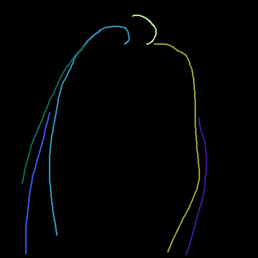
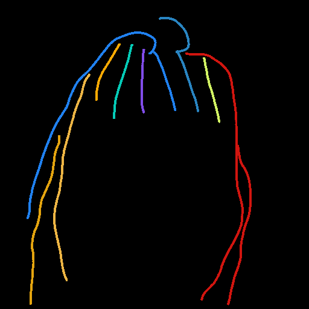
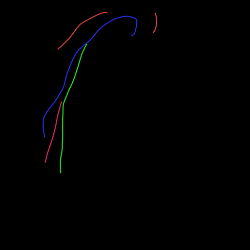
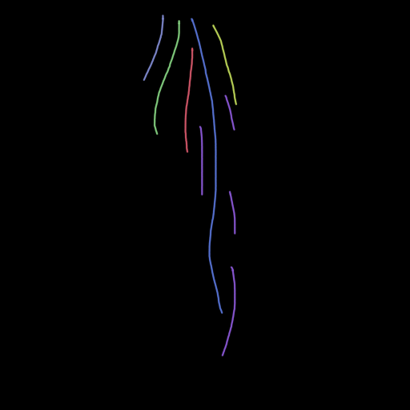

## mcs1~mcs6 차이 (config 기준)

| 구분 | matte_cond | matte_feat | raw_matte | gating(schedule) |
|---|---|---|---|---|
| mcs1 | O | O | O | X |
| mcs2 | O | O | O | O |
| mcs3 | X | O | O | X |
| mcs4 | X | O | O | O |
| mcs5 | O | X | O | X |
| mcs6 | O | O | X | X |

(O = 사용, X = 해당 조건/입력을 0으로 비활성화)

## CM_1004 vs CM_1004_1 sketch/matte 비교

| 구분 | CM_1004 | CM_1004_1 |
|---|---|---|
| sketch |  |  |
| matte |  |  |

## CM_1004_1 추론 결과 (GT color, BLD 적용) — mcs1~mcs6

| mcs1 | mcs2 | mcs3 | mcs4 | mcs5 | mcs6 |
|---|---|---|---|---|---|
|  |  |  |  |  |  |

## braid_2562 vs braid_2562_1, braid_2534 vs braid_2534_1 sketch 비교

| 구분 | braid_2562 | braid_2562_1 | braid_2534 | braid_2534_1 |
|---|---|---|---|---|
| sketch |  |  |  |  |

## braid_2562_1 추론 결과 (GT color, BLD 적용) — mcs1~mcs6

| mcs1 | mcs2 | mcs3 | mcs4 | mcs5 | mcs6 |
|---|---|---|---|---|---|
|  |  |  |  |  |  |

## braid_2534_1 추론 결과 (GT color, BLD 적용) — mcs1~mcs6

| mcs1 | mcs2 | mcs3 | mcs4 | mcs5 | mcs6 |
|---|---|---|---|---|---|
|  |  |  |  |  |  |
