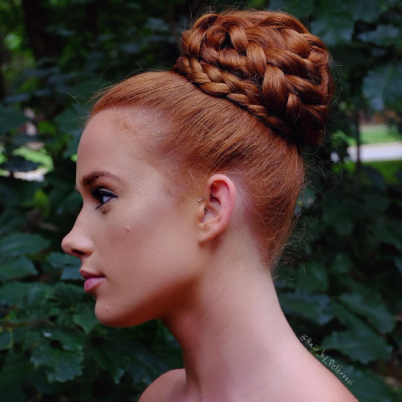
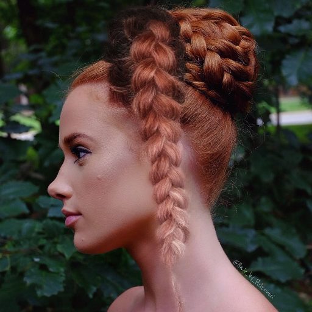
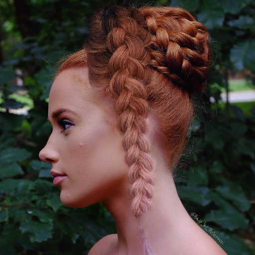
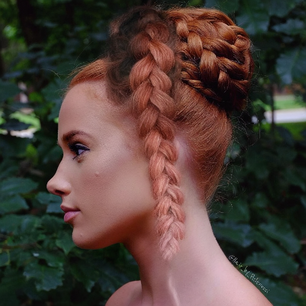
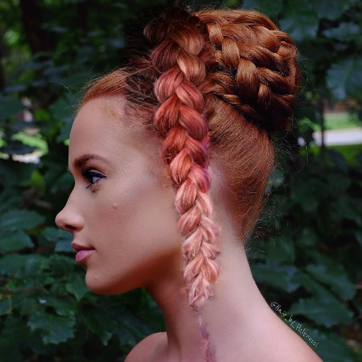
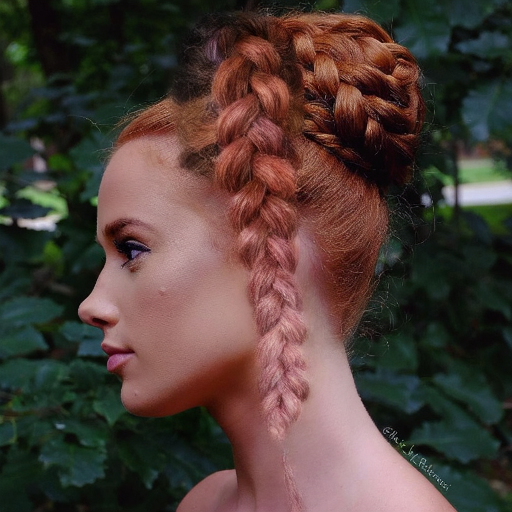
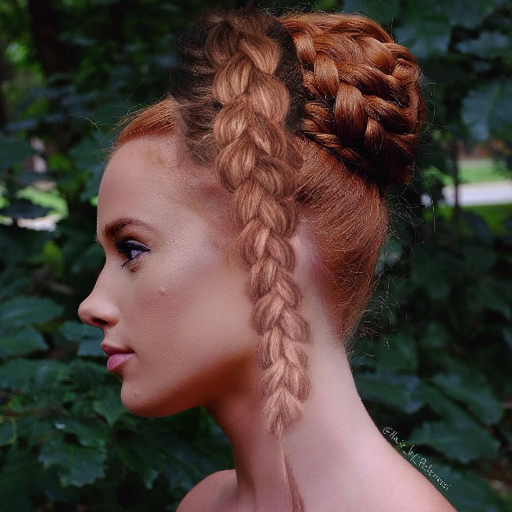

## 배경 변경(bg_change) 입력에 대한 모델별 결과 비교

기존 입력(face/sketch/matte)의 배경을 다른 배경으로 교체한 데이터로 hair 생성 결과를 비교
모든 결과는 **BLD(매 스텝 블렌딩) 적용, 디코딩 전에 배경 합성 미적용** 기준

**입력 (배경 변경된 face)**

| 원본 face | 배경 변경 face |
|---|---|
|  |  |

**모델별 결과 (BLD, hair patch only)**

| mcs1 | mcs2 | mcs3 | mcs4 | mcs5 | mcs6 |
|---|---|---|---|---|---|
|  |  |  |  |  |  |

## BLD vs 디코딩 전 배경 합성(composite_full): latent blending 비교

- 수식 구조 `M·A + (1-M)·B`, 마스크 `M`(matte→64x64 보간) 동일
- 차이: A/B 대상과 적용 시점

| | BLD | composite_full |
|---|---|---|
| A | 노이즈 낀 중간 `latents` | 최종 `hair_latent` |
| B | 노이즈 섞인 face latent | clean face latent |
| 시점 | 매 스텝 반복 | decode 직전 1회 후처리
ㄴ