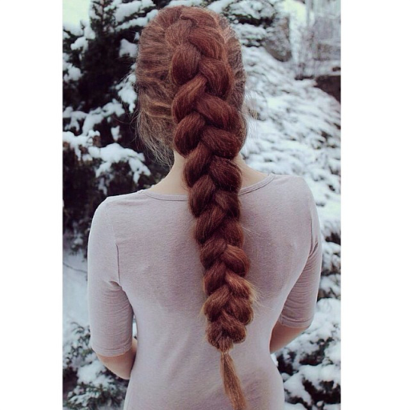
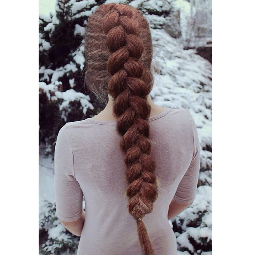
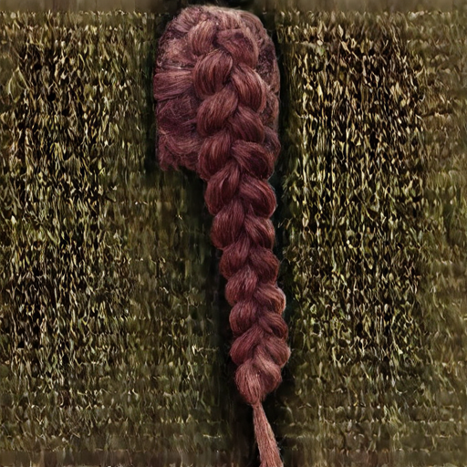
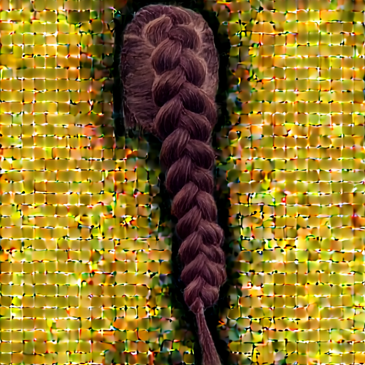
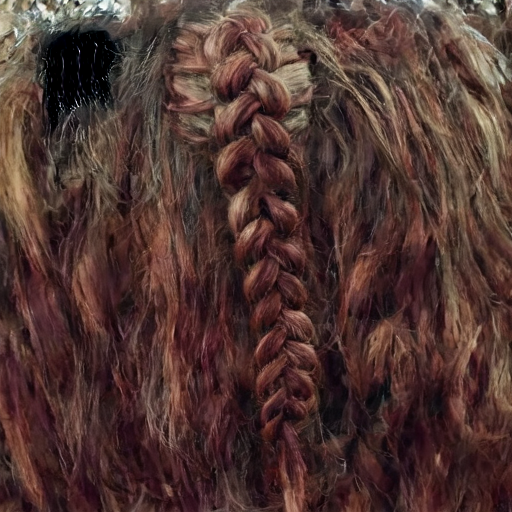
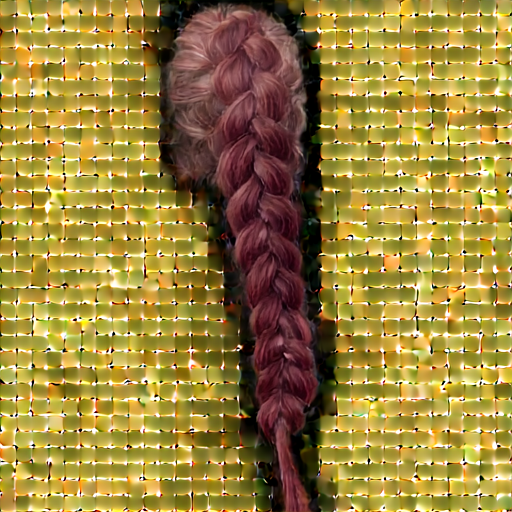
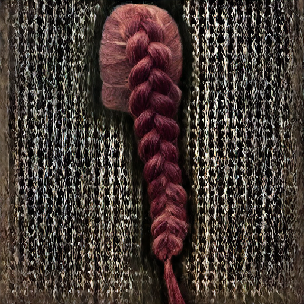
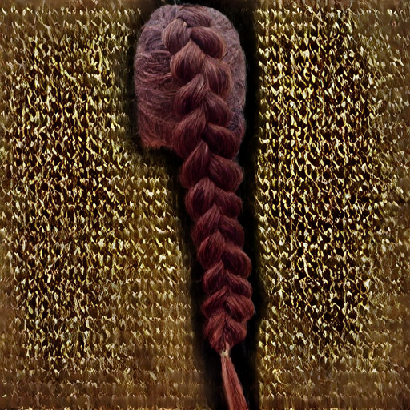

## BLD(Blended Latent Diffusion) 적용 방식별 비교

src_latent를 결과물에 반영하는 세 가지 방식을 비교한다.

1. **BLD (매 스텝 블렌딩)**: 디노이징 매 스텝마다 matte 바깥 영역을 src의 noised latent로 갈아끼움
2. **합성만 (composite_full)**: 디노이징 중에는 개입하지 않고, 최종 hair_latent를 디코딩하기 전에 src_latent와 한 번만 합성
3. **미적용 (hair patch only)**: src_latent를 전혀 사용하지 않고 생성된 hair_latent만 디코딩

| 구분 | mcs1 | mcs2 | mcs3 | mcs4 | mcs5 | mcs6 |
|---|---|---|---|---|---|---|
| ① BLD (매 스텝 블렌딩) |  |  |  |  |  |  |
| ② 합성만 (composite_full) |  |  |  |  |  |  |
| ③ 미적용 (hair patch only) |  |  |  |  |  |  |
