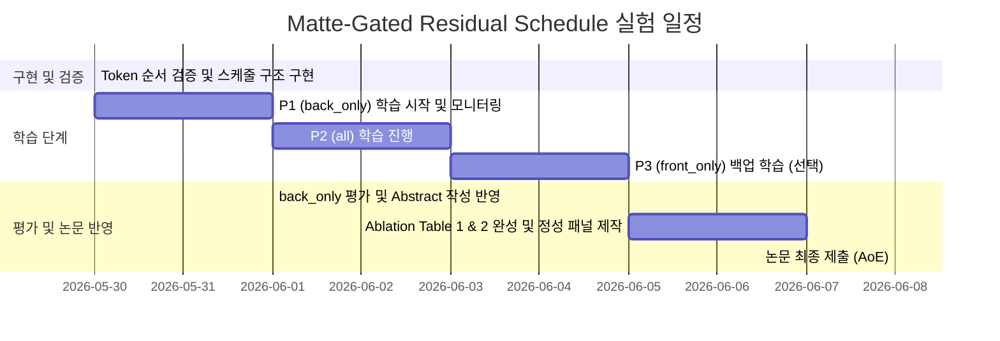

# Matte-Gated Residual Schedule - 실험 계획서

본 계획서는 [2026-05-30-matte-gated-implementation-experiment.md](file:///wsl.localhost/Ubuntu-22.04-D/home/agliotomato/hair-dit/2026-05-30-matte-gated-implementation-experiment.md) 지침에 의거하여 작성되었으며, 코드베이스 변경 없이 오직 **실험 설계 및 일정 수립**만을 목적으로 합니다. 

> [!NOTE]
> 본 실험 계획은 같은 날 교신저자가 작성한 Matte-Gated Residual Schedule 설계에 맞추어 작성되었으며, `[0530][서현택]matte.md`(현재 구조)를 기저로 삼아 아키텍처적 기여(Architectural Contribution)를 명확히 입증하기 위한 Ablation 셋업으로 구성되었습니다.

---

## 1. 핵심 가설 및 목표

> **"Diffusion Transformer(DiT) 구조에서 ControlNet의 residual 주입 시, 전역 맥락(Global Context)을 유지하면서 국소 영역(Local Detail)을 정밀하게 제어하기 위해서는 명시적인 Gating Schedule이 필요하며, 후반부 블록에만 이를 적용하는 `back_only` 방식이 최적이다."**

* **목표**:
  1. Matte 입력 조건화(Matte-conditioned) 모델 위에 잔차 필터링(Matte-gated)을 얹는 아키텍처 구현.
  2. 게이팅 적용 블록 위치에 따른 스케줄링 실험(`none`, `front_only`, `all`, `back_only`) 진행.
  3. 경계면 및 비-헤어 영역(얼굴, 배경)으로의 잔차 전파(Bleeding)를 효과적으로 억제하는 `back_only` 방식의 우수성 입증.

---

## 2. 실험 대상 모델 및 우선순위 (Resource Allocation)

6/8 논문 마감(AoE) 및 6/1 초록 마감 일정에 맞춘 현실적인 병렬 학습 우선순위입니다.

| 우선순위 | 실험 조건 (Schedule) | 적용 블록 | 학습 필요성 | 비고 및 리스크 대비책 |
| :---: | --- | :---: | :---: | --- |
| **P0 (기존)** | `none` | 없음 (0-23) | **학습 불필요** | **현재 구축 완료된 베이스라인 모델** 활용. 추가 학습 시간 0. |
| **P1 (핵심)** | `back_only` (Ours) | 후반부 12개 (12-23) | **신규 학습** | **우리의 메인 제안 방식.** 즉각적인 구현 검증 후 가장 먼저 학습 런칭. |
| **P2 (대조)** | `all` | 전체 24개 (0-23) | **신규 학습** | 전역적 어텐션 붕괴를 보여주기 위한 가장 강력한 비교 대조군. |
| **P3 (참고)** | `front_only` | 전반부 12개 (0-11) | **신규 학습** | 시간 부족 시 생략 가능 (초록/논문 본문에서 생략 또는 간소화 처리 가능). |

> [!TIP]
> **학습 시간 단축 전략 (지도 상의 합의 사항)**
> 일정상 시간이 매우 촉박하므로, **Phase 1 (Unbraid pretraining) 단계는 기존 체크포인트를 그대로 공유**하고, **Phase 2 (Braid finetuning) 단계에서만 스케줄링 gating을 적용하여 학습**하는 방향을 권장합니다.
> 이렇게 하면 아키텍처 효과를 타겟 영역에서 선명하게 분리해내면서도 학습 비용과 시간을 50% 이상 아낄 수 있습니다.

---

## 3. 정량적 평가 매트릭 설계 (Ablation Table)

gating 유무 및 스케줄에 따른 헤어 생성 퀄리티와 비-헤어 영역 보존 수준을 정밀 분석합니다.

```
+----------------------------------------------------------------------------------------------------------------+
|  Schedule   | Hair FID ↓ | LPIPS ↓ | SSIM ↑ | PSNR ↑ | Edge IoU ↑ | Chamfer ↓ | Boundary LPIPS ↓ | Face LPIPS ↓ |
+-------------+------------+---------+--------+--------+------------+-----------+------------------+--------------+
| none        |  [기존값]  |         |        |        |            |           |                  |              |
| front_only  |            |         |        |        |            |           |                  |              |
| all         |            |         |        |        |            |           |                  |              |
| back_only   |  (Target)  |         |        |        |            |           |                  |              |
+----------------------------------------------------------------------------------------------------------------+
```

### 🔍 주요 관전 지표
* **Boundary LPIPS 및 Face LPIPS**: 게이팅이 경계 부근을 얼마나 정교하게 격리하는지 입증하는 지표로, `back_only` 방식이 `none`이나 `all`보다 유의미하게 우수함을 입증해야 합니다.
* **Edge IoU / Chamfer**: 헤어 에지 선 표현력 평가.

---

## 4. 리스크 관리 계획 (Risk & Fallback)

> [!WARNING]
> **핵심 리스크 및 대응 시나리오 (Fallback)**
> * **토큰 순서 불일치**: 학습 시작 전, 32x32로 reshape된 `matte_tok`을 로컬 시각화하여 원본 마스크와 상하/좌우가 일치하는지 무조건 눈으로 확인하세요 (가장 흔한 실패 리스크).
> * **경계면 아티팩트 발생**: Hard 0/1 마스킹 대신 부드러운 `matte_tok` (0~1 그대로)을 사용합니다. 경계선 아티팩트 발생 시 게이트를 `matte + ε(1-matte)` 형태로 스무딩 처리합니다.
> * **베이스라인 대비 성능 미흡**: `back_only`가 `none`보다 부진할 경우, 억지로 결과를 튜닝하지 않고 솔직하게 보고합니다. 이 경우 아키텍처 기여도(Gating)는 ablation evidence로 남겨두고, 논문의 무게중심을 **Curriculum Learning의 SOTA 성능(Ablation C)**과 **Matte Conditioning 자체의 기여도(Ablation A)**로 유연하게 복귀(Fallback)시킵니다.

---

## 5. 마일스톤 및 마감 일정 (5/30 - 6/8)



---
*본 계획서는 지침 사항을 한눈에 알아보기 쉽게 요약하여 구성된 대시보드이며, 어떠한 코드 변경 없이 실험 구조만을 정밀하게 조율하기 위해 작성되었습니다.*
